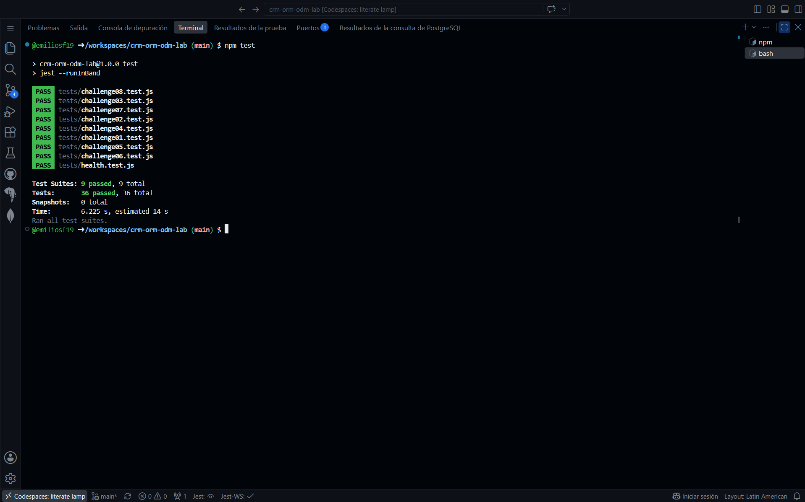

# CRM ORM/ODM Lab

API REST de un CRM básico que combina un ORM (Sequelize + PostgreSQL) y un ODM (Mongoose + MongoDB).

## Stack

- Node.js 22, Express 5, CommonJS
- Sequelize + PostgreSQL 16 (`User`, `Company`, `Contact`)
- Mongoose + MongoDB 7 (`Activity`)
- Jest + Supertest
- GitHub Codespaces, Dev Containers, Docker Compose
- Supervisor (`npm run dev`)

## Arquitectura

```text
GitHub Codespace
│
├── app       Node.js 22  ──┬── Sequelize ──> postgres (PostgreSQL)
│                           └── Mongoose  ──> mongo    (MongoDB)
├── postgres
└── mongo
```

La aplicación se conecta por nombre de servicio (`postgres`, `mongo`). Las credenciales de desarrollo llegan como variables de entorno definidas en `.devcontainer/docker-compose.yml` (ver `.env.example`).

## Iniciar el Codespace

1. En GitHub: **Code → Codespaces → Create codespace on main**.
2. Espera a que se levanten los tres servicios (`app`, `postgres`, `mongo`). `postCreateCommand` ejecuta `npm install`.

## Instalar dependencias

```bash
npm install
```

## Seed y reset

```bash
npm run seed    # inserta datos deterministas (3 users, 4 companies, 8 contacts, 10 activities)
npm run reset   # elimina y recrea tablas/base de datos y vuelve a sembrar
```

## Iniciar la API

```bash
npm start       # node ./bin/www
npm run dev     # supervisor ./bin/www
```

Servidor en el puerto `3000` (variable `PORT`).

## Pruebas

```bash
npm test
```

Cada suite restablece PostgreSQL y MongoDB antes de ejecutarse y cierra las conexiones al terminar.

## Endpoints

| Método | Ruta | Descripción |
|---|---|---|
| GET | `/health` | Health check |
| GET | `/users` | Listar usuarios |
| GET | `/users/:id` | Obtener usuario |
| POST | `/users` | Crear usuario |
| PUT | `/users/:id` | Actualizar usuario |
| DELETE | `/users/:id` | Eliminar usuario |
| GET | `/companies` | Listar compañías (`?industry=`) |
| GET | `/companies/:id` | Obtener compañía |
| POST | `/companies` | Crear compañía |
| PUT | `/companies/:id` | Actualizar compañía |
| DELETE | `/companies/:id` | Eliminar compañía |
| GET | `/contacts` | Listar contactos |
| GET | `/contacts/:id` | Obtener contacto |
| POST | `/contacts` | Crear contacto |
| PUT | `/contacts/:id` | Actualizar contacto |
| DELETE | `/contacts/:id` | Eliminar contacto |
| GET | `/activities` | Listar actividades (`?type=`) |
| GET | `/activities/:id` | Obtener actividad |
| POST | `/activities` | Crear actividad |
| PUT | `/activities/:id` | Actualizar actividad |
| DELETE | `/activities/:id` | Eliminar actividad |

Los errores se devuelven como JSON: `{ "error": "Contact not found" }`.

## Respuestas
**1. Dos motores.**
Company, User y Contact como tablas en base de datos suelen ser naturalmente relacionales (datos empresariales de este tipo se manejan mejor conectados entre ellos con llaves foraneas). Mientras que Activity desgloza un recibo de las actividades realizadas, la información en este no tiene la intención de cambiar.

**2. ORM vs ODM.**
El ORM (Object Relational Mappper) traduce la información de la base de datos SQL con su formato correspondiente a código con el que se puede trabajar, su libreria en el código es Sequelize. ODM (Object Document Mapper) tiene la misma función con bases de NoSQL (de documentos en este caso), su libreria en el código es Mongoose. La diferencia principal es que uno trabaja con bases de datos SQL (utilizando tablas y filas) mientras que la otra es con bases de datos NoSQL (trabajando con colecciones y documentos).

**3. Configuración por variables de entorno.**
Las variables de entorno se encuentran configuradas en el archivo `.devcontainer/docker-compose.yml`, con `DB_HOST` apuntando al host `postgres` y `MONGODB_URI` apuntando a `mongo`. No se recomienda definirlas en JavaScript ya que estos archivos suelen ser los relacionados al proyecto, y a la hora de trabajar en código abierto la información de conexión de la base de datos se suele mantener en privado. No son `localhost` debido a que se tienen que definir en contenedores diferentes.

**4. Asociaciones.**
Tienen una relación 1:M, donde una compañía tiene muchos contactos y cada contacto le corresponde a una sola compañía. La llave foránea es `companyId` y se encuentra en la tabla `contacts`, el cual sirve para referenciar esta tabla en otras partes del código.

**5. Eager loading.**
De la primera manera se realizan dos consultas separadas, mientras que el `include` solo realiza una, trayendo la tabla con un JOIN y permitiendo ahorrar recursos en ocasiones donde se requieren realizar varias consultas.

**6. Instancia vs consulta.**
`Model.update({...}, { where })` es más directo y ahorra menos recursos al hacer una sola consulta, pero este solo devuelve la cantidad de filas afectadas; mientras que buscar y modificar el registro hace dos consultas, gastando más recursos pero retornando los datos actualizados.

**7. Esquema flexible.**
Utiliza el tipo de dato `mongoose.Schema.Types.Mixed`, el cual permite definir la estructura de los datos de manera arbitraria para que se alinea a las especificaciones que necesitamos, debido a esto se pueden guardar datos mal escritos o estructuras incorrectas.

**8. Sin ref.**
Debido a problemas de compatibilidad, ya que `ref` y `populate` solo funcionan en MongoDB y las tablas de usuarios y contactos viven en PostgreSQL, por lo que si se elimina un usuario, el documento de actividades guarda registro de un `userId` que no le pertenece a nadie.

**9. Documento actualizado.**
Devolvía los datos del documento presuntamente actualizados, para corregirlo le añadí las opciones `new: true` y `runValidators: true` para que devuelva el documento actualizado y valide los datos respectivamente.

**10. Pruebas de comportamiento.**
Al probar el comportamiento puedes observar directamente las salidas que da el programa, permitiendo ver que datos si retorna y cuales no, facilitando ver los errores específicos en el código.

**11. Repetibilidad.**
`tests/setup.js` reestablece los datos introducidos y cierra las conexiones de las bases de datos con el proposito de mantener el estado original de los contenidos de las bases de datos (ya que estas pudieron haber sufrido modificaciones permanentes a las hora de realizar las pruebas). Esto con el proposito de que cada vez que se realize `npm test` sea con datos limpios y las pruebas funciones correctamente.

**12. Tu experiencia.**
El reto más complicado en mi opinión fue el reto 8, debido a que los demás solían compartir la solución o tener una solución similar, mientras que este fue un poco más obtuso y requirió indagar más en la documentación, ciertamente no fue de mucha ayuda los mensajes de Jest, ya que informaban lo obvio (no coincide la información).

## Evidencia
